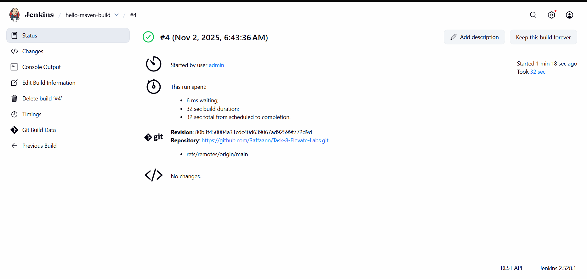

Task 8: Simple Java Maven Build in Jenkins
This repository contains the source code for Task 8 of the Elevate Labs DevOps Internship. The objective of this task was to learn the fundamentals of Continuous Integration (CI) by setting up a Jenkins job to build a simple Java application using Maven.

📝 Objective
To successfully configure a Jenkins Freestyle project that:

1. Pulls Java source code from this GitHub repository.
2. Compiles the code using Maven.
3. Executes the clean package Maven goals.
4. Produces a BUILD SUCCESS status.

🛠️ Tools Used
Java (JDK 11): The language for the simple application.

Maven: Used for project build and dependency management.

Jenkins: The CI/CD automation server used to run the build.

Docker: Used to run the Jenkins controller in a container.

Git & GitHub: For version control and as the source code repository.

 Process :
1. Code Creation: A simple HelloWorld.java application was created and placed in the src/main/java directory.

2. POM Setup: A pom.xml file was written to define the project, specify the Java version (1.8), and add the maven-compiler-plugin.

3. Jenkins Setup: The jenkins/jenkins:lts Docker image was used to start a Jenkins controller locally.

4. Tool Configuration: Jenkins was configured by adding JDK 11 and Maven 3.8.6 in the Manage Jenkins > Global Tool Configuration section.

5. Job Creation: A new Freestyle project was created in Jenkins.

6. SCM Configuration: The job was linked to this GitHub repository (https://github.com/Raffaann/Task-8-Elevate-Labs.git) with the branch set to */main.

7. Build Step: An "Invoke top-level Maven targets" build step was added with the goals clean package.

8. Troubleshooting: The build initially failed because the pom.xml was in a sub-directory (hello-java-maven). This was fixed by clicking Advanced... in the build step and setting the POM field to hello-java-maven/pom.xml.

9. Build Execution: The job was run manually, which successfully pulled the code, compiled it, and produced a BUILD SUCCESS log.

✅ Deliverable: Successful Build Screenshot
